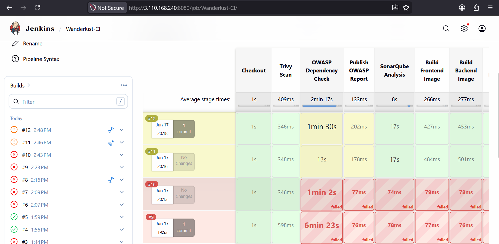
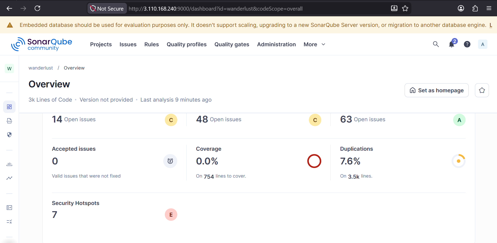
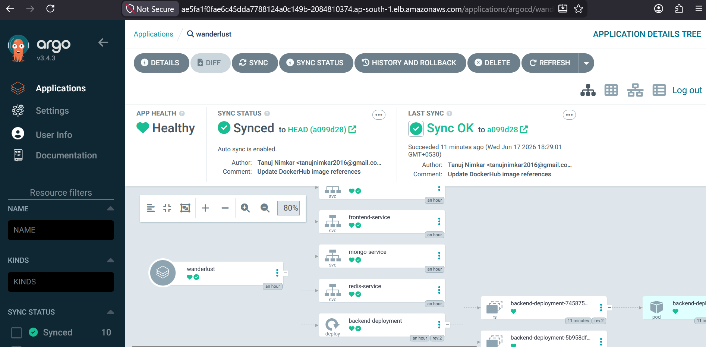
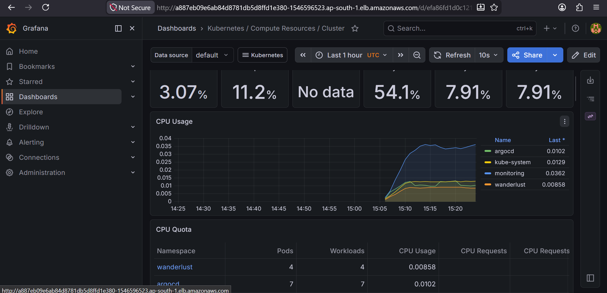
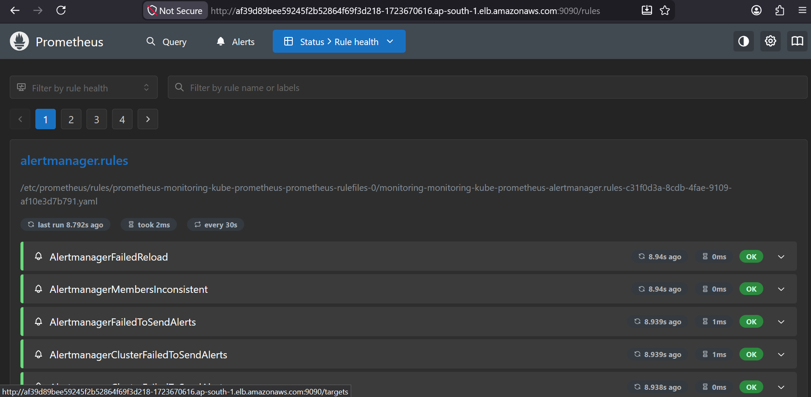
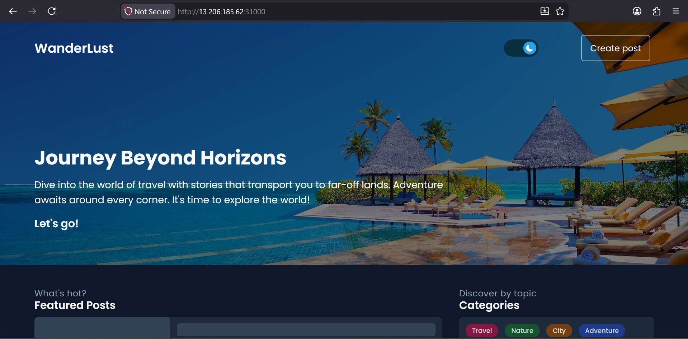

# 🚀 DevSecOps + GitOps Platform on AWS EKS

A production-grade DevSecOps project demonstrating the deployment of a three-tier MERN application on Amazon EKS using Jenkins, SonarQube, OWASP Dependency Check, Trivy, Docker, ArgoCD, Prometheus, and Grafana.

---

## 📌 Project Deployment Flow

<p align="center">
  
</p>

---

## 🏗️ Architecture

<p align="center">
  
</p>

---

## 🔄 CI/CD Workflow

<p align="center">
  
</p>

---

## 🛠️ Tech Stack

### Source Code Management
- GitHub

### Continuous Integration
- Jenkins

### Security & Code Quality
- OWASP Dependency Check
- SonarQube
- Trivy

### Containerization
- Docker

### Continuous Deployment
- ArgoCD

### Kubernetes & Cloud
- AWS EKS
- Kubernetes
- kubectl
- eksctl
- Redis

### Monitoring & Observability
- Prometheus
- Grafana

---

## ☁️ AWS Infrastructure

| Component | Configuration |
|------------|--------------|
| AWS Region | ap-south-1 (Mumbai) |
| Jenkins Master | t3.small |
| Jenkins Worker | t3.small |
| EKS Worker Nodes | t3.small |
| Storage | 30 GB |
| Kubernetes Platform | Amazon EKS |

---

## 🔐 DevSecOps Pipeline

### Jenkins CI Pipeline

✅ Source Code Checkout

✅ OWASP Dependency Check

✅ SonarQube Analysis

✅ Trivy Filesystem Scan

✅ Docker Image Build

✅ Docker Image Push

✅ Trigger CD Pipeline

### Security Gates

#### OWASP Dependency Check

- Detects vulnerable dependencies
- Generates vulnerability reports

#### SonarQube

- Static Code Analysis
- Code Smells Detection
- Security Hotspots
- Vulnerability Detection
- Quality Gate Validation

#### Trivy

- Filesystem Scanning
- Vulnerability Detection
- Secret Scanning
- Misconfiguration Detection

---

## 🚀 GitOps Deployment Pipeline

### Jenkins CD Pipeline

✅ Update Docker Image Version

✅ Commit Updated Manifest

✅ Push Changes to GitHub

✅ ArgoCD Detects Changes

✅ Automatic Synchronization

✅ Kubernetes Rolling Deployment

✅ Zero Downtime Deployment

---

## 📸 Jenkins CI Pipeline

<p align="center">
  
</p>

---

## 📸 SonarQube Analysis

<p align="center">
  
</p>

---

## 📸 ArgoCD Deployment

<p align="center">
  
</p>

---

## ☸️ Kubernetes Deployment

Application Components:

### Frontend
- React.js
- NodePort Service

### Backend
- Node.js
- Express.js
- REST APIs

### Database
- MongoDB

### Cache
- Redis

### Deployment Strategy

```text
Rolling Updates
Zero Downtime Deployment
Auto Sync using ArgoCD
```

---

## 📊 Monitoring Stack

### Prometheus

Monitors:

- Kubernetes Nodes
- Pods
- Deployments
- Services
- Cluster Health

### Grafana

Visualizes:

- CPU Usage
- Memory Usage
- Pod Health
- Node Health
- Cluster Metrics

---

## 📸 Grafana Dashboard

<p align="center">
  
</p>

---

## 📸 Prometheus Dashboard

<p align="center">
  
</p>

---

## 📧 Email Notifications

Configured Jenkins Email Extension Plugin for:

✅ Build Success Notifications

✅ Build Failure Notifications

✅ Deployment Status Notifications

✅ Security Scan Status Notifications

---

## 🔄 End-to-End Workflow

```text
Developer
   │
   ▼
GitHub Repository
   │
   ▼
Jenkins CI Pipeline
   │
   ├── OWASP Dependency Check
   ├── SonarQube Analysis
   ├── Trivy Scan
   │
   ▼
Docker Build
   │
   ▼
DockerHub
   │
   ▼
Jenkins CD Pipeline
   │
   ▼
Update Kubernetes Manifest
   │
   ▼
GitHub Repository
   │
   ▼
ArgoCD Auto Sync
   │
   ▼
Amazon EKS Cluster
   │
   ▼
Application Deployment
   │
   ▼
Prometheus Monitoring
   │
   ▼
Grafana Dashboards
   │
   ▼
Email Notifications
```

---

## 📸 Application Deployment

<p align="center">
  
</p>

---

## 🎯 Key Features

✅ End-to-End DevSecOps Implementation

✅ GitOps-Based Deployment Strategy

✅ AWS EKS Kubernetes Deployment

✅ Automated Security Scanning

✅ SonarQube Quality Gates

✅ Dockerized Application

✅ ArgoCD Continuous Delivery

✅ Zero Downtime Deployments

✅ Prometheus Monitoring

✅ Grafana Dashboards

✅ Email Notifications

✅ Secure Credential Management

✅ Fully Automated CI/CD Pipeline

---

## 📂 Repository Structure

```text
devsecops-gitops-eks-platform
│
├── Assets/
│   ├── DevSecOps+GitOps.gif
│   ├── architectures.png
│   ├── flow.png
│   ├── argocd-application.png
│   ├── application-homepage.png
│   ├── grafana-dashboard.png
│   ├── jenkins-ci-pipeline.png
│   ├── Prometheus.png
│   └── Sonar.png
│
├── kubernetes/
├── jenkins/
├── automation/
├── monitoring/
└── README.md
```

---

## 🏆 Project Highlights

- Production-style DevSecOps implementation
- Automated CI/CD pipeline
- Security-first deployment workflow
- GitOps with ArgoCD
- Kubernetes on AWS EKS
- Continuous Monitoring & Observability
- Infrastructure Automation
- Cloud-Native Deployment

---

## 👨‍💻 Author

### Tanuj Nimkar

DevOps Engineer | Cloud Enthusiast | Kubernetes Practitioner

### Technologies Used

- GitHub
- Jenkins
- Docker
- SonarQube
- Trivy
- OWASP Dependency Check
- ArgoCD
- Kubernetes
- AWS EKS
- Prometheus
- Grafana
- Redis

---

⭐ If you found this project useful, consider giving it a star.