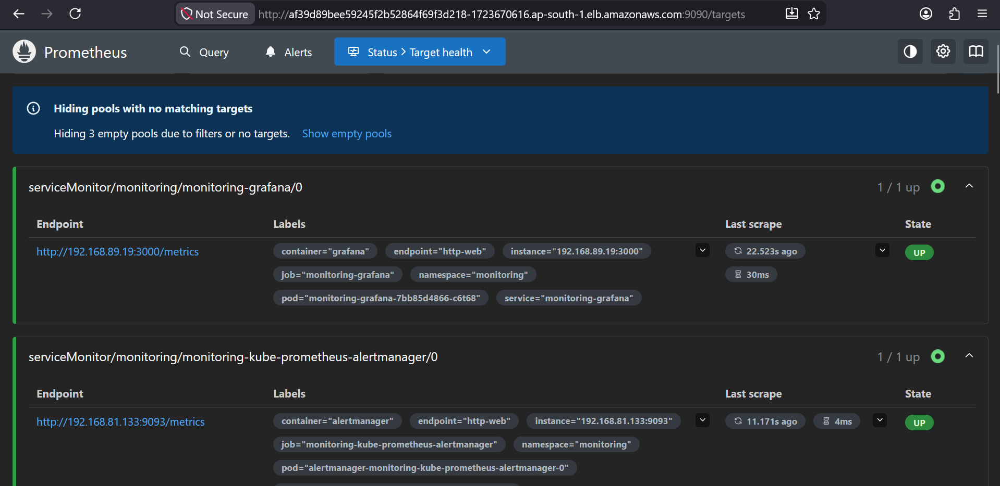

# 🚀 DevSecOps + GitOps Platform on AWS EKS

[](https://aws.amazon.com/eks/)
[](https://kubernetes.io/)
[](https://www.jenkins.io/)
[](https://argo-cd.readthedocs.io/)
[](https://www.docker.com/)
[](https://prometheus.io/)
[](https://grafana.com/)

## 📖 Project Overview

This project demonstrates a complete Production-Grade DevSecOps + GitOps implementation for deploying a Three-Tier MERN Stack Application on Amazon EKS.

The platform integrates:

- Continuous Integration (CI)
- Security Scanning
- Code Quality Analysis
- Containerization
- GitOps-Based Deployment
- Kubernetes Orchestration
- Monitoring & Observability
- Automated Notifications

---

# 🎯 Project Deployment Flow


---

# 🏗️ Solution Architecture


---

# 🔄 CI/CD Workflow


---

# 🛠️ Technology Stack

| Category | Tools |
|-----------|---------|
| Source Control | GitHub |
| CI/CD | Jenkins, ArgoCD |
| Security | OWASP Dependency Check, Trivy |
| Code Quality | SonarQube |
| Containerization | Docker |
| Orchestration | Kubernetes |
| Cloud | AWS EKS |
| Monitoring | Prometheus |
| Visualization | Grafana |
| Cache | Redis |

---

# ☁️ AWS Infrastructure

| Component | Configuration |
|------------|--------------|
| Region | ap-south-1 (Mumbai) |
| Jenkins Master | t3.small |
| Jenkins Worker | t3.small |
| EKS Worker Nodes | t3.small |
| Kubernetes Platform | Amazon EKS |
| Monitoring Stack | Prometheus + Grafana |
| Deployment Strategy | GitOps |

---

# 🔐 DevSecOps Security Pipeline

The CI pipeline integrates multiple security and quality gates before deployment.

### OWASP Dependency Check

- Vulnerability Detection
- Dependency Analysis
- CVE Reporting

### SonarQube

- Code Quality Analysis
- Security Hotspots
- Bugs Detection
- Code Smells
- Maintainability Checks

### Trivy

- Filesystem Scanning
- Container Vulnerability Scanning
- Secret Detection
- Misconfiguration Detection

---

# 🚀 Jenkins CI Pipeline

### Pipeline Stages

```text
Checkout Source Code
        ↓
OWASP Dependency Check
        ↓
SonarQube Analysis
        ↓
Trivy Scan
        ↓
Docker Build
        ↓
Docker Push
        ↓
Trigger CD Pipeline
```

---

## 📸 Jenkins CI Pipeline


---

# 🔍 SonarQube Analysis

Integrated SonarQube Quality Gates ensure only quality code progresses through the pipeline.


---

# 🚀 GitOps Continuous Deployment

Deployment automation is implemented using Jenkins CD and ArgoCD.

### Deployment Flow

```text
Update Docker Image Tag
          ↓
Update Kubernetes Manifest
          ↓
Push Changes to GitHub
          ↓
ArgoCD Detects Changes
          ↓
Automatic Sync
          ↓
Deploy to Amazon EKS
```

---

# ☸️ ArgoCD GitOps Deployment

### Benefits

✅ Declarative Deployments

✅ Continuous Delivery

✅ Drift Detection

✅ Self-Healing Applications

✅ Version Controlled Infrastructure

✅ Automated Synchronization


---

# ☸️ Kubernetes Deployment

### Frontend

- React.js

### Backend

- Node.js
- Express.js

### Database

- MongoDB

### Cache Layer

- Redis

### Deployment Features

✅ Rolling Updates

✅ Self-Healing Pods

✅ High Availability

✅ GitOps Delivery Model

✅ Zero Downtime Releases

---

# 📊 Monitoring & Observability

Monitoring stack deployed using Helm on Amazon EKS.

---

## Grafana Dashboard

Visualizes:

- Cluster Health
- Node Metrics
- Pod Metrics
- CPU Usage
- Memory Usage
- Resource Utilization


---

## Prometheus Monitoring

Collects metrics from:

- Kubernetes Nodes
- Pods
- Deployments
- Services
- Grafana
- AlertManager
- Application Workloads


---

## Prometheus Target Health

Monitoring targets successfully scraped by Prometheus.



---

# 📧 Email Notifications

Jenkins Email Extension Plugin configured for:

✅ Build Success Notifications

✅ Build Failure Notifications

✅ Security Scan Results

✅ Deployment Status

✅ Pipeline Completion Alerts

---

# 🌐 Application Deployment

Production deployment running successfully on Amazon EKS.


---

# 🔄 Complete End-to-End Workflow

```text
Developer
    │
    ▼
GitHub Repository
    │
    ▼
Jenkins CI Pipeline
    │
    ├── OWASP Dependency Check
    ├── SonarQube Analysis
    ├── Trivy Scan
    │
    ▼
Docker Build
    │
    ▼
DockerHub
    │
    ▼
Jenkins CD Pipeline
    │
    ▼
Update Kubernetes Manifest
    │
    ▼
GitHub Repository
    │
    ▼
ArgoCD Auto Sync
    │
    ▼
Amazon EKS
    │
    ▼
Application Deployment
    │
    ▼
Prometheus
    │
    ▼
Grafana
    │
    ▼
Email Notifications
```

---

# 🎯 Key Achievements

✅ Production-Grade DevSecOps Pipeline

✅ Secure CI/CD Implementation

✅ Automated Security Scanning

✅ GitOps Deployment Strategy

✅ Kubernetes Deployment on AWS EKS

✅ Zero Downtime Releases

✅ Continuous Monitoring

✅ Infrastructure Observability

✅ Fully Automated Delivery Workflow

---

# 📚 Skills Demonstrated

### DevOps

- Jenkins
- Docker
- GitOps
- CI/CD

### Kubernetes

- EKS Administration
- Deployments
- Services
- Monitoring

### Cloud

- AWS EC2
- AWS IAM
- AWS EKS
- Security Groups

### DevSecOps

- SonarQube
- Trivy
- OWASP Dependency Check
- Security Automation

### Monitoring

- Prometheus
- Grafana
- Metrics Collection
- Dashboarding

---

# 📂 Repository Structure

```text
devsecops-gitops-eks-platform
│
├── Assets
│   ├── DevSecOps+GitOps.gif
│   ├── architectures.png
│   ├── flow.png
│   ├── jenkins-ci-pipeline.png
│   ├── Sonar.png
│   ├── argocd-application.png
│   ├── grafana-dashboard.png
│   ├── Prometheus.png
│   ├── prometheus-2.png
│   └── application-homepage.png
│
├── kubernetes
├── jenkins
├── monitoring
└── README.md
```

---

# 👨‍💻 Author

## Tanuj Nimkar

DevOps Engineer | Cloud Enthusiast | Kubernetes Practitioner

### Core Skills

- AWS
- Kubernetes
- Docker
- Jenkins
- ArgoCD
- Linux
- GitHub
- Prometheus
- Grafana
- DevSecOps

---

⭐ If you found this project useful, consider giving it a Star.